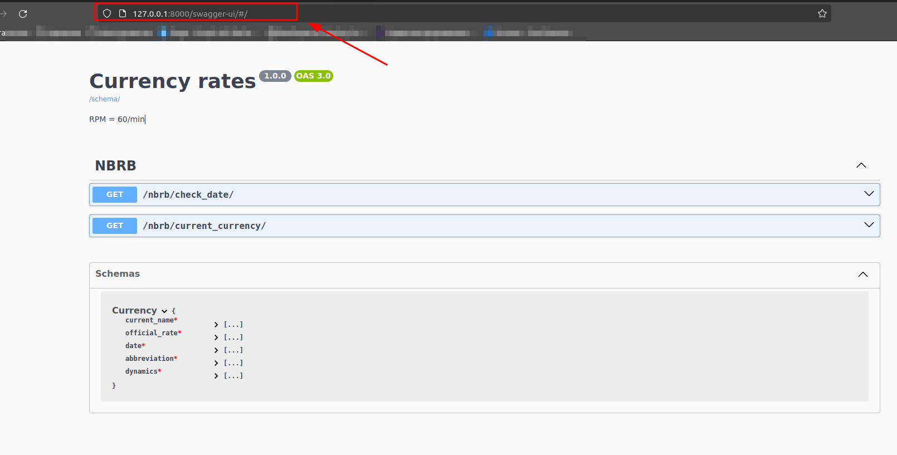
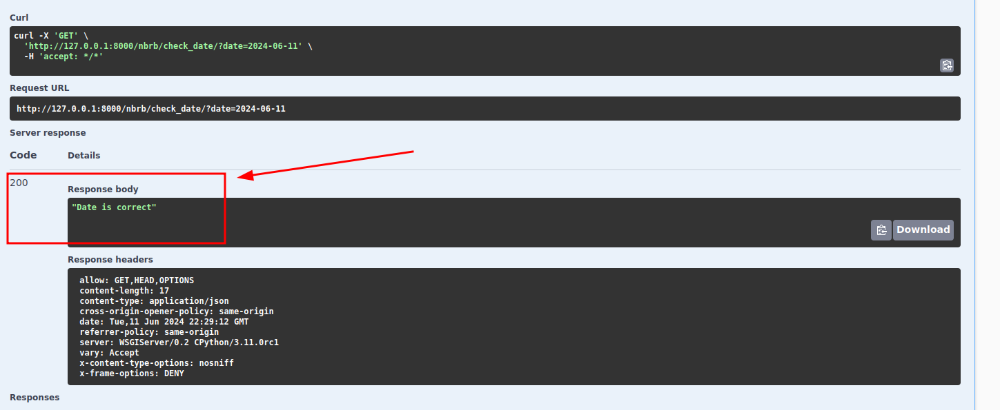
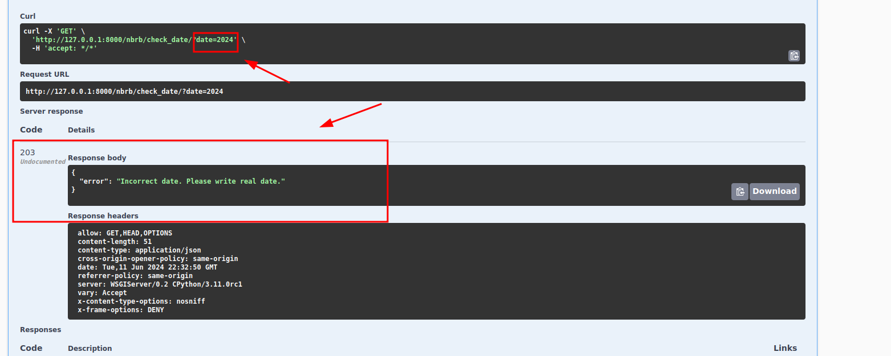
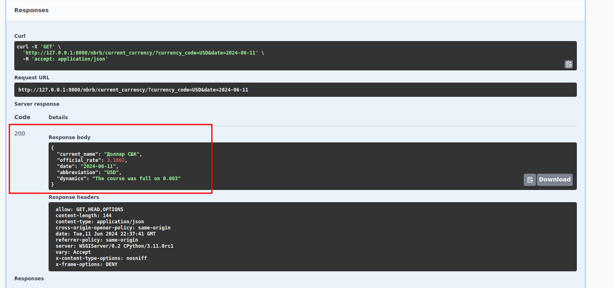
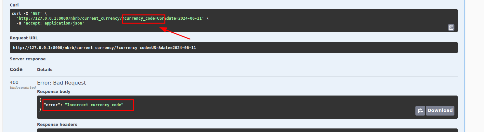
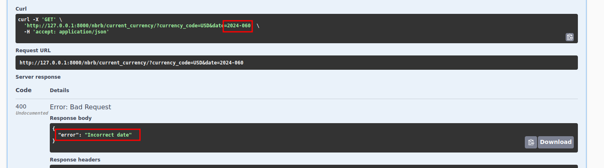
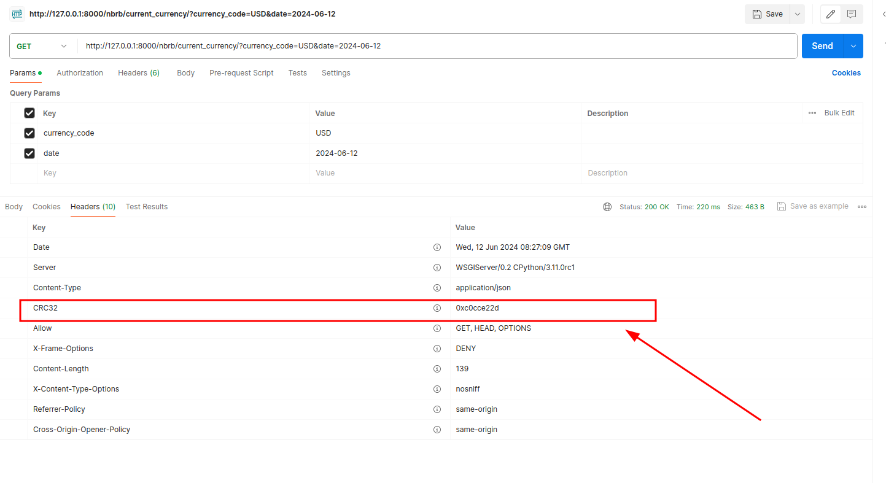

# Currency-rates
Selivonchyk Nikolay

## Как установить приложение
В первую очередь необходимо склонировать проект и перейти в склонированную директорию 
```
git clone https://github.com/YourBobi/currency_rates.git
```

Необходимо убедится что на устройстве стоит python 3.11 и после этого создать интерпритатор в текущей директории.

После необходимо установить пакет poetry и установить все зависимости.
```
$ pip install poetry
$ poetry shell
$ poetry install
```
Окружение настроено. DEBUG=True не убирал из settings.

## Описание приложения
Эндпоинты в нашем микросервисе реализованы через DRF и drf_spectacular. Настройка SPECTACULAR и DRF производилась в settings.
Проверка и исправления кода через flake8 и isort. Конфиг flake8 в корне директория.
Базы данных и кэш не использовал, т.к. работа идет со сторонним апи. Можно конечно кэшировать запросы для ускорения работы сервиса

Основное окно для работы с эндпоинтами находится по ссылке `/swagger-ui/#/`


### Endpoint  `/nbrb/check_date/`
В данной ручке проверяется корректность даты (вернутся ли нам во втором эндпоинте данные с данной датой). 
Под капотом идет запрос в api.nbrb.by. Если запрос прошел, значит дата корректна, в ином случае возвращается код с ошибкой и соответсвующим статусом  



### Endpoint  `/nbrb/current_currency/`
В данной ручке происходит запрос с двумя параметрами: дата, валюта. Возвращает она характеристики валюты на указанный день плюс разницу с предыдущим рабочим днем.
Под капотом идет два запроса в api.nbrb.by. Один для получения информации о валюте, другой для получения динамики изменений.
Так же присутствует валидация входных параметров.





Так же добавил crc32 в заголовок ответа. 
